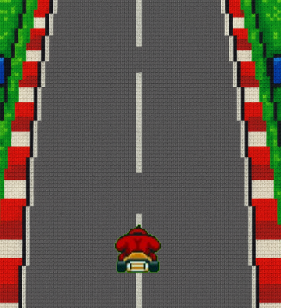

---

## ▶️ Cómo ejecutar el juego

Solo necesitas abrir `index.html` en un navegador moderno:

1. Clona este repositorio o descarga el ZIP.
2. Abre el archivo `index.html` con tu navegador favorito (Chrome, Firefox, Edge...).
3. ¡Presiona el botón **Iniciar Juego** y diviértete!

o [Acceder a traves de este enlace](https://saulomgit.github.io/Juego-OOP/)
---

## 🧪 Tecnologías usadas

- HTML5
- CSS3 (flexbox + media queries)
- JavaScript (POO y DOM)
- Fuentes: [Racing Sans One](https://fonts.google.com/specimen/Racing+Sans+One)

---

## 🚧 Posibles mejoras

- Añadir obstáculos con comportamiento dinámico.
- Power-ups o bonificaciones (vidas, escudos, etc.).
- Tabla de récords con almacenamiento local.
- Mejores efectos visuales o animaciones.
- Sonidos personalizados al chocar o esquivar.

---

## 📸 Captura

---

## 🏁 Créditos

Creado por Saul 
Inspirado en el universo de Mario Kart.  
Este proyecto es educativo y no está afiliado con Nintendo.

---
